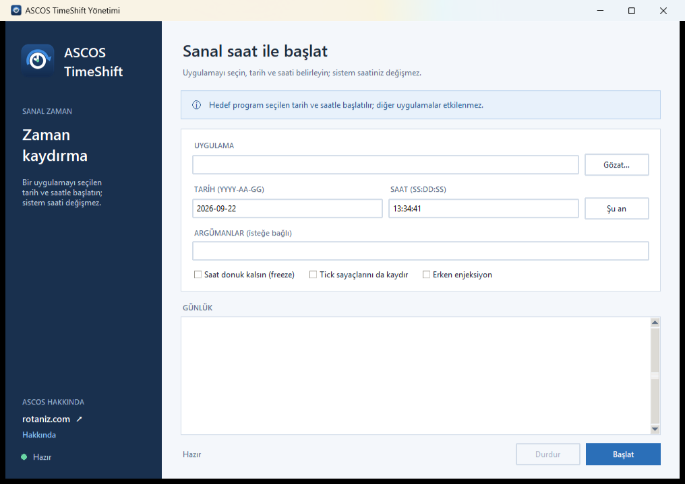

<p align="center">
  
</p>

<h1 align="center">ASCOS TimeShift</h1>

<p align="center">
  Hedef uygulamaları <b>sanal tarih/saat</b> ile başlatan Windows aracı.<br>
  Sistem saati değişmez; diğer programlar etkilenmez.
</p>



## Nedir?

ASCOS TimeShift, seçtiğiniz bir uygulamayı istediğiniz tarih ve saatle başlatır. Zaman API'leri yalnızca hedef süreç içinde [Frida](https://frida.re) ile hook'lanır ve gerçek saat yerine sizin verdiğiniz değer döndürülür. Bilgisayarın sistem saati hiçbir zaman değiştirilmez.

Test, eski tarihli verilerle çalışma ve tarih/saate bağlı davranışları doğrulama gibi senaryolar için geliştirilmiştir.

## Özellikler

- **İki mod:** ilerleyen saat (offset) ve donmuş saat
- **Kapsamlı hook listesi:** `GetSystemTime`, `GetLocalTime`, `GetSystemTimeAsFileTime`, `GetSystemTimePreciseAsFileTime` (kernelbase/kernel32), `NtQuerySystemTime` (ntdll), `time` / `_time32` / `_time64` (ucrtbase/msvcrt)
- **32-bit ve 64-bit** hedef desteği
- İsteğe bağlı **tick sayaç kaydırma** (`GetTickCount`, `GetTickCount64`)
- **Geç enjeksiyon** (varsayılan): korumalı uygulamalarda takılmayı önler
- **Erken enjeksiyon** (isteğe bağlı): hızlı açılıp kapanan hedefler için
- **Türkçe arayüz** (ASCOS tasarım dili) + komut satırı aracı
- **Türkçe MSI kurulumu**: kullanıcı kapsamlı, yönetici hakları gerekmez
- MIT lisanslı, üçüncü taraf bildirimleri dahil

## Nasıl çalışır?

1. Hedef uygulama askıda başlatılır ve süreç içine Frida ajanı (`agent.js`) enjekte edilir.
2. Ajan, gerçek saat ile istediğiniz saat arasındaki farkı (offset) hesaplar ve zaman API'lerine hook kurar.
3. Hook'lar fonksiyon çıkışında sonucu offset kadar kaydırır; donmuş modda saat sabit kalır.
4. Hedef uygulama normal şekilde çalışır; diğer tüm programlar gerçek saati görmeye devam eder.

Varsayılan **geç enjeksiyon** modunda süreç önce serbest bırakılır, ardından hook'lar kurulur (korumalı uygulamalarla uyumluluk için). Bu nedenle uygulamanın ilk ~0,3 saniyesi gerçek saati görebilir.

## Kurulum

En son sürümü [Releases](https://github.com/Kucukejderha/ascos-timeshift/releases/latest) sayfasından indirin:

1. `ASCOS-TimeShift-x.y.z.msi` dosyasını çalıştırın.
2. Yönetici hakları gerekmez; kurulum `%LOCALAPPDATA%\Programs\ASCOS TimeShift` altına yapılır.
3. Başlat Menüsü ve Masaüstü kısayolları otomatik oluşur.

## Kullanım

### Arayüz

Başlat Menüsü → **TimeShift**. Uygulamayı seçin, tarih ve saati girin, isterseniz modları işaretleyin ve **Başlat**'a basın.

### Komut satırı

```
TimeShift.exe --date 2020-06-15 --time 12:30:00 "C:\...\uygulama.exe" [argümanlar...]
```

| Seçenek | Açıklama |
|---|---|
| `--date YYYY-AA-GG` | Sahte tarih (zorunlu) |
| `--time SS:DD:SS` | Sahte saat (zorunlu) |
| `--freeze` | Saat ilerlemesin, sabit kalsın |
| `--ticks` | `GetTickCount` / `GetTickCount64` değerlerini de kaydır |
| `--early-attach` | Hook'ları süreç askıdayken kur (hızlı hedefler için) |
| `--cwd DIZIN` | Hedefin çalışma dizini (varsayılan: exe klasörü) |
| `--version` | Sürümü göster |

**Örnekler**

```powershell
# 2020-06-15 12:30 ile başlat
TimeShift.exe --date 2020-06-15 --time 12:30:00 "C:\Program Files\Ornek\uygulama.exe"

# Saat donuk kalsın
TimeShift.exe --freeze --date 2020-06-15 --time 12:30:00 "C:\...\uygulama.exe"

# Hedefe argüman ilet
TimeShift.exe --date 2024-01-01 --time 09:00:00 "C:\...\uygulama.exe" --profil test
```

### Argümanlar alanı

Arayüzdeki **Argümanlar** sahası, hedef uygulamaya komut satırı argümanı iletir; başlatırken exe yolunun ardına eklenir. Boş bırakılırsa uygulama argümansız açılır. Tırnaklı ifadeler desteklenir (`"C:\yol\dosya adı.txt"`).

## Sınırlamalar

- Sahte tarih, TLS sertifikalarının geçerlilik aralığı dışındaysa HTTPS bağlantıları başarısız olabilir.
- Kerberos/Active Directory: 5 dakikadan fazla sapmada kimlik doğrulama hatası oluşur.
- Anti-cheat/DRM içeren veya korumalı süreçler enjeksiyonu engelleyebilir.
- Varsayılan modda ilk ~0,3 sn gerçek saat görülebilir (bkz. `--early-attach`).
- Hook'lar alt süreçlere yayılmaz; hedefin başlattığı yardımcı programlar gerçek saati görür.
- Uygulama saatini kendi sunucusundan/NTP'den alıyorsa etkilenmez.
- Yalnızca kullanım hakkına sahip olduğunuz yazılımlarda, test amaçlı kullanın.

## Kaynaktan derleme

**Gereksinimler**

- Python 3.12+
- `pip install -r requirements.txt` (Frida)
- İkon üretimi için: `pip install pillow`
- Paketleme için: `pip install pyinstaller`
- MSI için: [WiX Toolset 7](https://wixtoolset.org) (`dotnet tool install --global wix` + `wix extension add -g WixToolset.UI.wixext`)

**Çalıştırma (kaynaktan)**

```powershell
python timeshift_gui.py
python timeshift.py --date 2020-06-15 --time 12:30:00 "C:\...\uygulama.exe"
```

**Exe + MSI üretimi**

```powershell
.\installer\build.ps1
```

Betik sırasıyla iki exe'yi (CLI + GUI) PyInstaller ile derler ve WiX ile Türkçe MSI paketini üretir.

**İkonu yeniden üretme**

```powershell
python .\assets\make_icon.py
```

## Proje yapısı

```
ASCOS TimeShift/
├─ agent.js                  # Frida ajanı: hook'lar, offset/donmuş mod mantığı
├─ timeshift.py              # Çekirdek + CLI (frida.spawn/attach, offset hesabı)
├─ timeshift_gui.py          # Türkçe arayüz (tkinter)
├─ requirements.txt          # Python bağımlılıkları
├─ assets/
│  ├─ make_icon.py           # İkon üretici (Pillow)
│  ├─ ASCOS-TimeShift.png    # 1024px ana ikon
│  ├─ ASCOS-TimeShift.ico    # Çok boyutlu Windows ikonu (16-256)
│  └─ ...                    # 128/52px ve arayüz görseli
├─ installer/
│  ├─ Product.wxs            # WiX MSI tanımı (TR, per-user, MIT lisans sayfası)
│  ├─ build.ps1              # Exe + MSI derleme betiği
│  ├─ make_license_rtf.py    # Lisans metnini RTF'e çevirir
│  └─ license/MIT.rtf        # Kurulum lisans sayfası içeriği
├─ LICENSE                   # MIT
└─ THIRD-PARTY-NOTICES.txt   # Frida, CPython, Tcl/Tk, PyInstaller bildirimleri
```

## Lisans

[MIT](LICENSE) — Copyright (c) 2026 ASCOS

Bu ürün Frida, CPython, Tcl/Tk ve PyInstaller bileşenlerini içerir; ilgili lisans bildirimleri için [THIRD-PARTY-NOTICES.txt](THIRD-PARTY-NOTICES.txt) dosyasına bakın.
